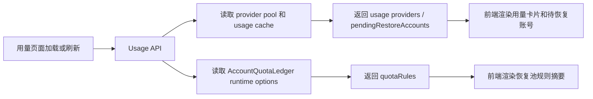

# Codex Plus 用量查询与恢复池规则展示设计

## 背景

用量查询页面当前只把 `openai-codex-oauth` 当作 Codex OAuth 用量提供商。项目中已经存在 `openai-codex-oauth-plus` provider pool，用于 Plus 账号或 Plus 路由，但该 provider type 没有出现在用量查询支持列表中。

本地额度账本 `AccountQuotaLedger` 已经负责把达到阈值、冷却中、等待重置确认、等待低频验证的账号移入“待恢复账号”视图。默认规则为 Free `70%`、Plus/Pro `90%`、其他 `85%`，并且可以通过 `ACCOUNT_QUOTA_LEDGER` 运行时配置覆盖。用户需要在用量查询页面直接看到当前生效规则，例如“Free 70%，Plus 90% 入恢复池”。

## 目标

- 用量查询支持 `openai-codex-oauth-plus`。
- Plus provider type 复用现有 Codex OAuth 用量查询与格式化逻辑，不新增独立 Codex Plus formatter。
- 用量 API 返回当前运行时 `ACCOUNT_QUOTA_LEDGER` 规则。
- 用量页面展示当前恢复池规则，显示 Free、Plus/Pro、默认阈值，以及账号池低可用触发条件。
- 页面显示的规则必须来自后端运行时配置，而不是前端写死默认值。

## 非目标

- 不在用量查询支持 Plus provider 时改变本地额度账本的阈值默认值。
- 不改变账号路由、估算用量、冷却、401/403 删除、429 处理或恢复验证逻辑。
- 不在页面上提供编辑恢复池规则的表单。
- 不为 `openai-codex-oauth-plus` 创建新的 credential schema。

## 后端设计

### 支持的 provider

`src/ui-modules/usage-api.js` 的 `supportedProviders` 增加 `openai-codex-oauth-plus`。

`UsageService.resolveSupportedProvider()` 已经支持派生 provider type：当 provider type 以基础 provider 加 `-` 开头时，复用基础 handler 和 formatter。因此 `openai-codex-oauth-plus` 会解析为 `openai-codex-oauth`，继续使用 `getCodexUsage()` 和 `formatCodexUsage()`。

provider pool 加载、缓存同步、单实例刷新、按 provider 刷新都以 provider type 字符串为 key。把 Plus provider type 纳入 supported providers 后，这些路径会自然覆盖 Plus pool。

### 恢复池规则输出

在 `src/ui-modules/usage-api.js` 中新增一个构建函数，例如 `buildQuotaRuleSummary(providerPoolManager)`。函数从 `providerPoolManager.accountQuotaLedger.options` 读取运行时规则，并返回：

- `enabled`
- `freeThresholdPercent`
- `plusThresholdPercent`
- `defaultThresholdPercent`
- `poolLowAvailableCount`
- `poolLowAvailableRatio`

如果 `accountQuotaLedger` 不存在或未启用，返回 `{ enabled: false }`。

所有用量响应都附带 `quotaRules`：

- `GET /api/usage`
- `GET /api/usage/:providerType`
- `GET /api/usage/:providerType/:uuid`
- `POST /api/usage/sync-provider-pool`

这样全量页面加载、单 provider 刷新、单实例刷新和账号池同步后的页面状态都能拿到同一份运行时规则。

## 前端设计

用量页面在支持 provider 信息下方显示一条紧凑规则摘要。文案由 `quotaRules` 渲染，示例：

`恢复池规则：Free >= 70% 入恢复池，Plus/Pro >= 90% 入恢复池，其他 >= 85%；可用账号 <= max(1, 总数 20%) 时触发恢复验证。`

英文对应文案：

`Restore rules: Free >= 70%, Plus/Pro >= 90%, others >= 85%; recovery verification is triggered when available accounts <= max(1, 20% of total).`

如果 `quotaRules.enabled === false`，显示账本未启用的简短状态，或隐藏规则摘要。推荐显示简短状态，方便排查为什么没有待恢复规则。

前端改动点：

- `static/components/section-usage.html` 新增 `usageQuotaRules` 容器。
- `static/app/usage-manager.js` 新增 `updateQuotaRulesInfo(data)`。
- `loadUsage()`、`refreshUsage()`、`refreshProviderUsage()`、`refreshSingleInstanceUsage()`、`syncProviderPoolUsage()` 在成功响应后调用规则更新。
- `static/app/i18n.js` 增加中英文文案 key。
- `static/components/section-usage.css` 增加规则摘要样式，延续现有 info banner 风格。

## 数据流

## 错误处理

- `quotaRules` 构建失败时记录日志，并返回 `{ enabled: false }`，避免影响用量查询主流程。
- Plus provider pool 为空时仍显示 provider 支持标签和规则摘要；用量列表没有实例属于正常状态。
- 如果 Plus provider 的 adapter 初始化或真实用量查询失败，沿用现有实例错误卡片和待恢复账本覆盖逻辑。
- 页面缺少规则容器时静默跳过，避免影响其他嵌入场景。

## 测试计划

- 后端测试：`GET /api/usage/supported-providers` 包含 `openai-codex-oauth-plus`。
- 后端测试：`GET /api/usage` 返回的 `quotaRules` 反映运行时 `ACCOUNT_QUOTA_LEDGER` 配置。
- 后端测试：当账本禁用或不存在时，`quotaRules.enabled` 为 `false`，接口仍返回用量数据。
- 单元或集成测试：Plus provider type 能通过现有 Codex usage formatter 处理缓存或真实响应。
- 前端手动验证：访问 `http://localhost:3001` 的用量页面，能看到规则摘要和 Plus provider 标签。
- 前端手动验证：修改配置阈值并重启服务后，规则摘要显示新值。
