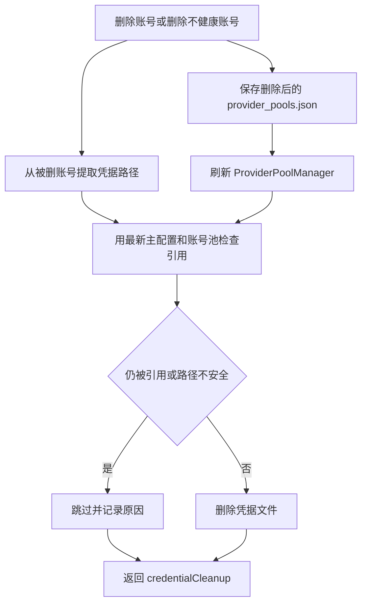

# 凭据孤儿文件自动清理设计

## 背景

当前 Web UI 的“凭据文件管理”可以扫描 `configs` 目录并显示文件是否被使用，也已有 `DELETE /api/upload-configs/delete-unbound` 用于批量删除未绑定配置文件。账号池账号删除逻辑位于 `src/ui-modules/provider-api.js`，它会从 `provider_pools.json` 删除账号并刷新内存中的 `ProviderPoolManager`，但不会删除该账号关联的凭据文件。

这会留下两类残留：用户删除账号后，对应凭据文件还留在 `configs/<provider>/...`；或者以前账号已经被删除，但凭据文件管理中仍存在未被任何账号引用的历史凭据文件。

## 目标

- 删除账号池账号时，自动清理该账号独占引用的凭据文件。
- 批量删除不健康账号时，对每个被删账号执行同样的凭据清理。
- “凭据文件管理”的未绑定文件清理继续支持删除历史残留，并复用同一套安全判断。
- 只删除 `configs/<provider>/...` 子目录中的孤儿凭据文件。
- 删除前必须确认该文件没有被主配置或其他账号继续引用。
- API 响应和广播事件包含凭据清理结果，便于前端刷新和排查。

## 非目标

- 不在服务启动时静默删除文件。
- 不删除项目外部路径、绝对路径指向项目外的文件、`configs` 根目录文件。
- 不删除 `configs/config.json`、`configs/provider_pools.json`、插件配置、用量缓存、API Key 数据库等核心配置文件。
- 不改变账号池调度、健康检查、额度账本或 OAuth 刷新逻辑。
- 不因为凭据清理失败而回滚已经完成的账号删除。

## 安全边界

自动清理只允许删除满足全部条件的文件：

1. 路径解析后仍位于当前项目的 `configs` 目录内。
2. 归一化路径形如 `configs/<provider>/...`，至少包含三段路径。
3. `<provider>` 能对应现有 provider 凭据目录，例如 `codex`、`gemini`、`kiro`、`qwen`、`antigravity`、`iflow`。
4. 文件扩展名属于凭据管理已扫描的凭据类文件，例如 `.json`、`.oauth`、`.creds`、`.key`、`.pem`、`.txt`。
5. 使用删除后的最新配置检查时，主配置和所有 provider pool 账号都不再引用该文件。

如果任一条件不满足，清理逻辑跳过该文件并返回原因。

## 后端设计

新增一个小型工具模块 `src/ui-modules/credential-cleanup.js`，集中提供以下能力：

- 从 provider 配置中提取凭据路径字段，支持 `*_CREDS_FILE_PATH` 和 `*_TOKEN_FILE_PATH`。
- 归一化路径并判断是否位于允许自动删除的 provider 子目录。
- 基于最新 `currentConfig` 与 `providerPools` 检查文件是否仍被引用。
- 删除孤儿凭据文件并返回结构化结果。

单账号删除流程调整为：

1. 从 `provider_pools.json` 读取当前账号池。
2. 找到并移除目标账号，保留被删账号原配置。
3. 保存更新后的 `provider_pools.json`。
4. 刷新 `providerPoolManager`。
5. 从被删账号中提取凭据路径。
6. 使用保存后的最新账号池和主配置判断这些凭据是否已成为孤儿。
7. 删除符合条件的孤儿凭据文件。
8. 在响应和 `config_update` 广播中附加 `credentialCleanup`。

批量删除不健康账号流程相同，只是输入变为所有被删除账号的凭据路径集合。重复路径需要去重，避免同一个文件被重复删除或重复返回。

“凭据文件管理”的 `handleDeleteUnboundConfigs` 保持用户主动清理语义，但内部删除前也调用同一套安全判断，避免误删 `configs` 根目录或核心配置文件。

## 数据流



## API 响应

删除账号接口继续返回原有字段，并新增 `credentialCleanup`：

```json
{
  "success": true,
  "message": "Provider deleted successfully",
  "deletedProvider": {},
  "credentialCleanup": {
    "deletedFiles": ["configs/codex/account-a.json"],
    "skippedFiles": [
      {
        "path": "configs/codex/shared.json",
        "reason": "still_referenced"
      }
    ],
    "failedFiles": []
  }
}
```

批量删除接口同样返回 `credentialCleanup`，并保留现有 `deletedCount`、`remainingCount`、`deletedProviders` 字段。

## 错误处理

- 凭据文件不存在：记录为 skipped 或 failed，不影响账号删除结果。
- 路径不在允许范围内：记录为 `unsafe_path`，不删除。
- 删除时发生权限或文件系统错误：记录到 `failedFiles`，响应仍保持账号删除成功。
- `provider_pools.json` 读取或保存失败：账号删除本身失败，保持现有 404 或 500 行为。
- 引用判断异常：跳过对应文件并记录错误，避免在不确定状态下删除。

## 测试计划

- 删除单个账号后，唯一引用的 `configs/<provider>/...` 凭据文件会被删除。
- 同一个凭据文件仍被另一个账号引用时，不删除并返回 `still_referenced`。
- 主配置仍引用同一个凭据文件时，不删除并返回 `still_referenced`。
- `configs` 根目录文件、核心配置文件、项目外路径不会被自动删除。
- 批量删除不健康账号时，只删除真正孤儿的凭据文件，并对重复路径去重。
- “删除未绑定配置文件”只删除安全目录内的孤儿凭据，不删除 `configs/provider_pools.json` 等核心配置。
- API 响应包含 `credentialCleanup`，前端现有刷新逻辑仍能工作。
