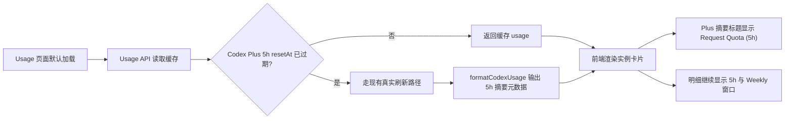

# Codex Plus 5h 用量摘要与缓存刷新设计

## 背景

用量查询页面已经支持 `openai-codex-oauth-plus`，并且 Codex 用量格式化器已经把原始 `primary_window` 展示为 `Request Quota (5h)`，把 `secondary_window` 展示为 `Weekly Limit`。

当前展开后的实例卡片顶部摘要仍固定使用“总用量”文案。对于 Codex Plus，这个摘要实际上不应该表达跨窗口总量，而应该直接表达 5 小时请求额度。同时 Usage API 默认优先返回 `configs/usage-cache.json`，缓存没有按 Codex 5h 重置时间失效；当缓存里的 5h 窗口已经越过 `resetAt` 时，页面仍可能继续显示旧百分比。

## 目标

- 仅对 `openai-codex-oauth-plus` 把展开卡片顶部摘要从“总用量”改为 `Request Quota (5h)`。
- Codex Plus 的明细区继续保留 `Request Quota (5h)` 与 `Weekly Limit` 两个窗口。
- 当 Codex Plus 缓存中的 5h 窗口已经过了重置时间时，默认用量查询不再继续返回旧缓存，而是刷新真实用量。
- 保持普通 Codex、其他 provider、现有手动刷新入口和现有额度账本叠加逻辑不变。

## 非目标

- 不修改 Codex 原始 usage 接口或 OAuth 授权流程。
- 不把普通 `openai-codex-oauth` 的展开摘要标题改成 5h 文案。
- 不移除 Codex Plus 的周窗口明细。
- 不为整个 Usage Cache 引入通用 TTL 策略。
- 不改变 AccountQuotaLedger 的额度阈值、恢复池规则或本地估算逻辑。

## 方案

采用后端定向修正。

Codex 用量格式化器继续负责把原始 rate-limit 窗口转换为标准 usage 结构，并在摘要中暴露 5h 窗口的显示元数据。Usage API 在读取缓存时识别 Codex Plus 5h 窗口是否已经过期；命中过期数据时绕过对应缓存读取分支，复用现有真实查询路径刷新数据。前端只根据 provider type 和后端摘要元数据选择标题文案。

这样默认页面加载、按 provider 加载和单实例加载都能避免把已过期的 5h 窗口当作当前用量展示，显示层也不会再把 Codex Plus 的 5h 摘要误叫成总用量。

## 后端设计

### Codex 格式化元数据

`src/services/usage-service.js` 的 `formatCodexUsage()` 继续输出现有 `items`：

- `primary_window`，标签 `Request Quota (5h)`
- `secondary_window`，标签 `Weekly Limit`

摘要仍使用当前的 `summary.usedPercent`、`summary.status`、`summary.resetAt` 结构，避免影响现有 collapsed card、额度账本和缓存重格式化逻辑。同时摘要增加足够的显示元数据，让消费方明确这个摘要可以代表 5h 窗口，例如：

- `summary.displayLabel = 'Request Quota (5h)'`
- `summary.primaryItemId = 'primary_window'`

格式化器不知道调用方是普通 Codex 还是 Codex Plus，因此该元数据可以在两类 Codex usage 上都存在；是否把它用于卡片标题由前端 provider type 决定。

### Codex Plus 缓存新鲜度

`src/ui-modules/usage-api.js` 增加 Codex Plus 专用的新鲜度判断。判断对象是格式化后的 usage，优先从 `items` 中找到 `primary_window` 的 `resetAt`；缺少该 item 或缺少可解析的重置时间时，不主动判定为过期，继续沿用现有缓存行为。

当 `primary_window.resetAt <= Date.now()` 时，该 Codex Plus usage 视为陈旧：

- `GET /api/usage` 读取到包含陈旧 Codex Plus 5h usage 的全量缓存时，绕过全量缓存分支，复用现有全量真实刷新路径。
- `GET /api/usage/:providerType` 在 `providerType === 'openai-codex-oauth-plus'` 且 provider 缓存含陈旧 5h usage 时，绕过 provider 缓存分支，复用现有 provider 刷新路径。
- `GET /api/usage/:providerType/:uuid` 在目标 Codex Plus 实例缓存含陈旧 5h usage 时，绕过单实例缓存分支，复用现有单实例刷新路径。

显式 `refresh=true` 请求保持现有语义，始终走真实查询，不依赖缓存新鲜度判断。

## 前端设计

`static/app/usage-manager.js` 的展开摘要标题增加一层选择逻辑：

- 默认继续使用 `usage.card.totalUsage`。
- 当实例 provider type 是 `openai-codex-oauth-plus` 且 `usage.summary.displayLabel` 存在时，使用后端返回的 `displayLabel`。

该逻辑只影响展开卡片顶部摘要，不影响 collapsed card 的百分比展示，也不影响下方 `items` 明细。Codex Plus 展开后会看到：

1. 顶部摘要：`Request Quota (5h)`
2. 明细项：`Request Quota (5h)`
3. 明细项：`Weekly Limit`

这样保留原有细节信息，同时把顶部摘要含义说清楚。

## 数据流

## 错误处理

- 缓存缺少 `primary_window` 或重置时间不可解析时，不将缓存强制判旧，避免因为异常数据形状造成额外刷新风暴。
- 过期缓存触发真实刷新后，如果适配器初始化或 usage 查询失败，沿用现有错误卡片、错误计数和授权失败处理路径。
- 刷新失败时不把已确认过期的 Codex Plus 5h 缓存重新包装成当前数据返回，避免页面继续显示误导性的旧百分比。
- 额度账本叠加后的本地估算展示继续由现有 Usage API 流程处理，不在本次改动中另起一套 reset 逻辑。

## 测试计划

- 单元测试 `formatCodexUsage()`：Codex rate-limit 响应保留 `primary_window` 与 `secondary_window` 明细，并在摘要中带上 5h 显示元数据。
- Usage API 测试：`GET /api/usage` 遇到已过期的 Codex Plus 5h 缓存时，不直接返回旧缓存，而会走真实刷新路径。
- Usage API 测试：Codex Plus provider 或单实例缓存未过期时仍复用缓存，避免默认加载无条件刷新。
- 前端验证：Codex Plus 展开摘要标题显示 `Request Quota (5h)`，普通 Codex 和其他 provider 仍显示“总用量”。
- 服务验证：修改代码后用 `aiclient2api.sh restart` 重启服务，并在 `http://localhost:3001` 检查默认加载、全量刷新和单实例刷新行为。
